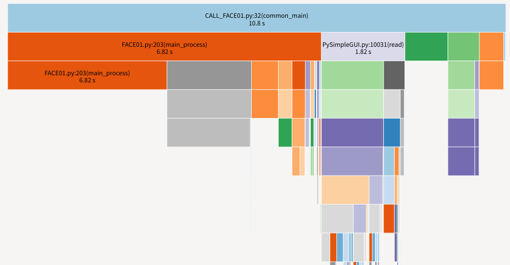
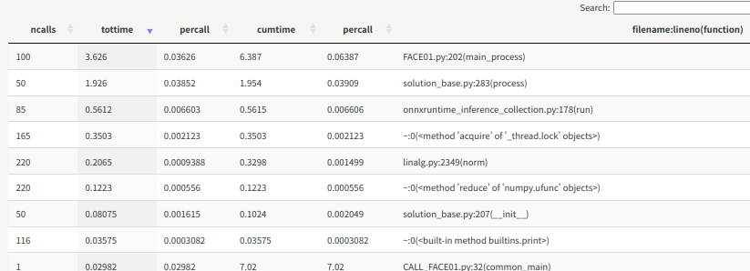
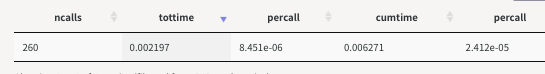
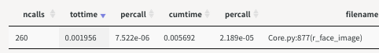
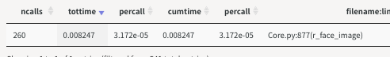

<!-- TODO #1:
- 校正
- GIFファイル化 -->
# 一時的なコード秘匿にCythonを！

# 環境
```bash
Cython==0.29.30
Python 3.8.10
(FACE01) 
$ inxi -SCGxx --filter
System:    Kernel: 5.15.0-46-generic x86_64 bits: 64 compiler: N/A Desktop: Unity wm: gnome-shell dm: GDM3 
           Distro: Ubuntu 20.04.4 LTS (Focal Fossa) 
CPU:       Topology: Quad Core model: AMD Ryzen 5 1400 bits: 64 type: MT MCP arch: Zen rev: 1 L2 cache: 2048 KiB 
Graphics:  Device-1: NVIDIA TU116 [GeForce GTX 1660 Ti] vendor: Micro-Star MSI driver: nvidia v: 515.65.01 bus ID: 08:00.0 
```
# Cythonをコード秘匿に使う
Cythonについての記事を観察していると公式例の高速化手法を紹介していることが多い印象です。(cdefで書き換えたファイルを別途用意したり等)
Python高速化の需要は多く手軽な手法としてCythonが紹介されますが、この記事では**秘匿化とそれに伴う低速化**について取り上げます。手軽な秘匿化は低速化をもたらします。
結論はCythonサイコーなのですが、理由は**秘匿の手軽さ**に尽きます。
公式ドキュメントに書いてあるとおりいくつかのやり方が存在しますが`magic cython module`手法を紹介します。

公式ドキュメントからそのまま引っ張ってきたものや単純な計算だけのエグザンプルコードは役に立つとは思えないので、少なくともオブジェクトをやり取りするようなものを実際のプロジェクトから引っこ抜いて来ました。
共有ライブラリとしてコンパイルします。

> このドキュメントでは[FACE01](https://github.com/yKesamaru/FACE01_SAMPLE)を例にします。
> FACE01はPythonから利用する多機能な顔認識ライブラリです。

## ソースコードの秘匿手法
Pythonにおけるソースコード秘匿手法について調べると、クラウドでやれとかPyArmorを使えと出てきます。
これでは問題の解決にはなりません。

Cythonは生Pythonをバイナリ化出来ます。Python互換性のないコードを書く必要がありません。Cython >=0.27からPure Python Modeが使えます。
```python
import cython
```
元のPythonファイルに変更が生じるたびに、別に存在する高速化コードも変更しなくてはいけないと非常に面倒くさいです。


### 例
下記は実際にコンパイルされたsoファイルを逆アセンブルした様子です。これで十分です。
```bash:逆アセンブル例
objdump -S logger.cpython-38-x86_64-linux-gnu.so 

logger.cpython-38-x86_64-linux-gnu.so:     ファイル形式 elf64-x86-64


セクション .init の逆アセンブル:

0000000000003000 <_init>:
    3000:	f3 0f 1e fa          	endbr64 
    3004:	48 83 ec 08          	sub    $0x8,%rsp
    3008:	48 8b 05 79 9f 00 00 	mov    0x9f79(%rip),%rax        # cf88 <__gmon_start__>
    300f:	48 85 c0             	test   %rax,%rax
    3012:	74 02                	je     3016 <_init+0x16>
    3014:	ff d0                	callq  *%rax
    3016:	48 83 c4 08          	add    $0x8,%rsp
    301a:	c3                   	retq   

セクション .plt の逆アセンブル:

0000000000003020 <.plt>:
    3020:	ff 35 e2 9f 00 00    	pushq  0x9fe2(%rip)        # d008 
# 以降省略
```

### プロファイル手法
cProfileとそれをブラウザで可視化するsnakeviz、細かい箇所は`time.perf_counter()`を用います。
また変換後のプロファイルを得るために
```python
#cython: profile=True
```
を先頭行付近に配置します。詳細は[こちら](https://cython.readthedocs.io/en/stable/src/tutorial/profiling_tutorial.html#enabling-profiling-for-a-complete-source-file)を参照してください。

これらのスニペットを挟むことにより尚更低速化が起こります。エグザンプルとしてわかりやすさのために挿入します。

## テストコード
ディレクトリ構成や出来ることは[こちら](https://github.com/yKesamaru/FACE01_SAMPLE)を参照してください。

```python
import cProfile as pr
import PySimpleGUI as sg
import cv2
import time
from face01lib.video_capture import VidCap
VidCap_obj = VidCap()
from face01lib.Core import Core
Core_obj = Core()
from sys import exit

import FACE01 as fg

"""DEBUG
Set the number of playback frames"""
exec_times: int = 50
ALL_FRAME = exec_times

# PySimpleGUI layout
sg.theme('LightGray')
if fg.args_dict["headless"] == False:
    layout = [
        [sg.Image(filename='', key='display', pad=(0,0))],
        [sg.Button('terminate', key='terminate', pad=(0,10), expand_x=True)]
    ]
    window = sg.Window(
        'FACE01 EXAMPLE', layout, alpha_channel = 1, margins=(10, 10),
        location=(0,0), modal = True, titlebar_icon="./images/g1320.png", icon="./images/g1320.png"
    )

def common_main(exec_times):
    profile_HANDLING_FRAME_TIME_FRONT = time.perf_counter()
    event = ''
    while True:
        try:
            frame_datas_array = fg.main_process().__next__()
        except Exception as e:
            print(e)
            exit(0)
        exec_times = exec_times - 1
        if  exec_times <= 0:
            break
        else:
            print(f'exec_times: {exec_times}')
            if fg.args_dict["headless"] == False:
                event, _ = window.read(timeout = 1)
                if event == sg.WIN_CLOSED:
                    print("The window was closed manually")
                    break
            for frame_datas in frame_datas_array:
                if "face_location_list" in frame_datas:
                    img, face_location_list, overlay, person_data_list = \
                        frame_datas['img'], frame_datas["face_location_list"], frame_datas["overlay"], frame_datas['person_data_list']
                    for person_data in person_data_list:
                        if len(person_data) == 0:
                            continue
                        name, pict, date,  location, percentage_and_symbol = \
                            person_data['name'], person_data['pict'], person_data['date'],  person_data['location'], person_data['percentage_and_symbol']
                        if name != 'Unknown':
                            result, score, ELE = Core_obj.return_anti_spoof(frame_datas['img'], person_data["location"])
                            if fg.args_dict["anti_spoof"] is True:
                                if ELE is False:
                                    print(
                                        name, "\n",
                                        "\t", "Anti spoof\t\t", result, "\n",
                                        "\t", "Anti spoof score\t", round(score * 100, 2), "%\n",
                                        "\t", "similarity\t\t", percentage_and_symbol, "\n",
                                        "\t", "coordinate\t\t", location, "\n",
                                        "\t", "time\t\t\t", date, "\n",
                                        "\t", "output\t\t\t", pict, "\n",
                                        "-------\n"
                                    )
                            else:
                                if ELE is False:
                                    print(
                                        name, "\n",
                                        "\t", "similarity\t\t", percentage_and_symbol, "\n",
                                        "\t", "coordinate\t\t", location, "\n",
                                        "\t", "time\t\t\t", date, "\n",
                                        "\t", "output\t\t\t", pict, "\n",
                                        "-------\n"
                                    )
                    if fg.args_dict["headless"] == False:
                        imgbytes = cv2.imencode(".png", img)[1].tobytes()
                        window["display"].update(data = imgbytes)
        if fg.args_dict["headless"] == False:
            if event =='terminate':
                break
    if fg.args_dict["headless"] == False:
        window.close()
    
    profile_HANDLING_FRAME_TIME_REAR = time.perf_counter()
    profile_HANDLING_FRAME_TIME = (profile_HANDLING_FRAME_TIME_REAR - profile_HANDLING_FRAME_TIME_FRONT) 
    print(f'Predetermined number of frames: {ALL_FRAME}')
    print(f'Number of frames processed: {ALL_FRAME - exec_times}')
    print(f'Total processing time: {round(profile_HANDLING_FRAME_TIME , 3)}[seconds]')
    print(f'Per frame: {round(profile_HANDLING_FRAME_TIME / (ALL_FRAME - exec_times), 3)}[seconds]')
pr.run('common_main(exec_times)', 'restats')
```

上記サンプルプログラムは50frame処理すると終了します。
呼び出される方(return_face_image())は260回コールされます。
終了した時点で
```bash
snakeviz restats 
```
を実行するとサーバが立ち上がって下記がブラウザに表示されます。バーをクリックすることで絞り込み可能で、テーブルの並び替えも出来る高性能なモジュールです。





# `Pure Python Mode`を利用
公式ドキュメントは[こちら](https://cython.readthedocs.io/en/stable/src/tutorial/pure.html)です。


## 呼び出し側コード
変数
frame: 画像データ (np.ndarray, ndim=3)
face_location: 顔座標 (tuple<int,int,int,int>)
```python
def r_face_image(self, frame, face_location):
    self.frame = frame
    self.face_location = face_location
    face_image = Return_face_image().return_face_image(self.frame, self.face_location)
    return face_image
```

## Pythonコード
```python
from __future__ import annotations
import numpy as np

class Return_face_image():
    def return_face_image(
        self,
        resized_frame,
        face_location: tuple
    ):
        """Return face image array which contain ndarray

        Args:
            resized_frame (numpy.ndarray): frame data
            face_location (tuple): face location which ordered top, right, bottom, left

        Returns:
            list: face image of ndarray or empty array
        """        
        self.resized_frame = resized_frame
        empty_ndarray = \
            np.empty(shape=(2,2,3), dtype=np.uint8)
        self.face_location: tuple = face_location

        if len(self.face_location) > 0:
            top: int = face_location[0]
            right: int = face_location[1]
            bottom: int = face_location[2]
            left: int = face_location[3]
            face_image = self.resized_frame[top:bottom, left:right]
            """DEBUG
            from face01lib.video_capture import VidCap
            VidCap().frame_imshow_for_debug(face_image)
            VidCap().frame_imshow_for_debug(self.resized_frame)
            """
            return face_image
        else:
            return empty_ndarray
```
## Pythonコード + Pure Python Mode (Cython)
```python
# 追加・変更可能部分

#cython: language_level=3
#cython: profile=True
""" これらは使用しません
# cython: boundscheck = False
# cython: wraparound = False
# cython: initializedcheck = False
# cython: cdivision = True
# cython: always_allow_keywords = False
# cython: unraisable_tracebacks = False
# cython: binding = False
"""

"""cythonでは使用不可
from __future__ import annotations
"""
def return_face_image(
    ...

    if len(self.face_location) > 0:
        top: cython.int = face_location[0]
        right: cython.int = face_location[1]
        bottom: cython.int = face_location[2]
        left: cython.int = face_location[3]
        face_image: np.ndarray = self.resized_frame[top:bottom, left:right]
```

追加・変更部分は非常に少ないです。
`int`は`cython.int`に変更。

### コンパイルコード
```python
from setuptools import setup
from Cython.Build import cythonize
import glob

py_file_list = glob.glob('~/bin/FACE01/face01lib/pyx/*pyx')
for pyfile in py_file_list:
    setup(
        ext_modules = cythonize(
            pyfile,
        )
    )
```

## C++コード (Pybind11使用)
仮に全く別のコードを書いてみたらどうでしょう。C++を用います。
```C++
#include <iostream>
#include <pybind11/pybind11.h>
#include <pybind11/numpy.h>
/*
https://pybind11.readthedocs.io/en/stable/advanced/pyC++/numpy.html?highlight=numpy#numpy
https://stackoverflow.com/questions/61821844/how-to-express-thisa03-03-in-python-as-cpybind11
*/
namespace py = pybind11;
    
class Return_face_image
{
public:
    // コンストラクタ
    Return_face_image(){}

    py::array_t<uint8_t> return_face_image(
        const py::array resized_frame,
        const std::tuple<int, int, int, int> &face_location)
    {
        int top = std::get<0>(face_location);
        int right = std::get<1>(face_location);
        int bottom = std::get<2>(face_location);
        int left = std::get<3>(face_location);
        int step = 1;

        py::array face_image = 
        resized_frame[py::make_tuple( py::slice(top,bottom, step), py::slice(left,right,step),py::slice(0,3, step))];

        return face_image;
    }
};

PYBIND11_MODULE(return_face_image, m)
{
    py::class_<Return_face_image>(m, "Return_face_image")
        .def(py::init<>())
        .def(
            "return_face_image",
            &Return_face_image::return_face_image)
        .def("__init__", [](const Return_face_image &)
             { return "<Return_face_image>"; });
};
```

### コンパイルコード
```python
from setuptools import setup
from pybind11.setup_helpers import Pybind11Extension, build_ext

ext_modules = \
    [Pybind11Extension(
        "return_face_image",
        ["./return_face_image.cpp"]
    )]

setup(
    cmdclass={"build_ext": build_ext},
    ext_modules = ext_modules
)
```

# 速度計測結果
## 出力
```bash
Audrey Hepburn 
         Anti spoof              real 
         Anti spoof score        99.0 %
         similarity              99.2% 
         coordinate              (127, 403, 324, 206) 
         time                    2022,08,20,23,05,42,579428 
         output                   
 -------

Audrey Hepburn 
         Anti spoof              real 
         Anti spoof score        99.0 %
         similarity              99.2% 
         coordinate              (127, 403, 324, 206) 
         time                    2022,08,20,23,05,42,592691 
         output                  output/Audrey Hepburn_2022,08,20,23,05,42,597155_0.36.png 
 -------
# 以降省略
```


## Python
```bash
Predetermined number of frames: 50
Number of frames processed: 50
Total processing time: 11.895[seconds]
Per frame: 0.238[seconds]
```


## Cython
```bash
Predetermined number of frames: 50
Number of frames processed: 50
Total processing time: 11.678[seconds]
Per frame: 0.234[seconds]
```


## C++
```bash
Predetermined number of frames: 50
Number of frames processed: 50
Total processing time: 11.879[seconds]
Per frame: 0.238[seconds]
```


## 処理速度

生のPythonコードの処理にかかった時間を1として、CythonとC++で書かれたコードの処理時間を計算しました。
C++が4倍近くかかっているのは巨大なndarrayを値渡ししているからです。ポインターを受け取ってスライスするにはもう少し複雑なコードを書かねばいけません。
Cythonの処理時間が0.9なのは誤差です。実際もっと複雑な処理が書かれたPythonコードをコンパイルすると3倍かかることがあります。これは内部で非効率なオブジェクト処理がなされるからです。

# まとめ
今回はPythonコードの秘匿化手法を紹介しました。
Pure Python Modeを使用する限り、Cython化は非常に有効な手段です。
- デメリット
  - Pure Python Modeがまだまだ発展途上
  - 処理速度が低下する
- メリット
  - Pythonコードと互換性のないコードを書く必要がない

# リファレンス
- [FACE01](https://github.com/yKesamaru/FACE01_SAMPLE)
  - Multi-functional face recognition library 
- [Cython](https://cython.readthedocs.io/en/stable/index.html)
  - [Magic Attributes](https://cython.readthedocs.io/en/stable/src/tutorial/pure.html#magic-attributes)
  - 

